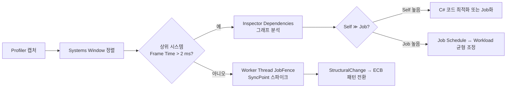

# Profiler · Systems Window로 병목 파악하기  
### Inspector 관계 탭 · 실행시간 열 활용

Unity Entities 프로젝트에서 **FPS 드롭**이나 **프레임 스파이크**가 생기면,  
먼저 **Profiler** 와 **Systems Window** 를 함께 열어 병목 시스템을 찾아야 합니다.

---

## 1. Profiler 설정

| 단계 | 방법 |
|------|------|
| **Deep Profile Off** | 일반적으로 꺼두고, 구체적 함수 분석이 필요할 때만 ON |
| **Record** | 미리 300–500 프레임 캡처 후 재생 확인 |
| **Modules** | **CPU Usage**, **Timeline**, **Entity Debugger** 모듈 추가 |
| **Filters** | 특정 월드(World)·스레드(Woker) 만 표시해 노이즈 감소 |

### 1‑1 Timeline 뷰

* **Main Thread** — `PlayerLoop` → `SimulationSystemGroup.OnUpdate` 구간 길이 확인  
* **Worker Threads** — `JobXxx` 실행 시간 · `JobFence` 대기 구간 식별  
* **SyncPoint** — `EntityCommandBufferPlayback` 이벤트 → StructuralChange 병목

---

## 2. Systems Window – Frame Time 열

| 열 | 의미 |
|----|------|
| **Frame Time** | 시스템 실행 + 내부 잡 완료까지 총 소요 시간 |
| **Self** | 메인 스레드에서 순수 C# 코드 실행 시간 (잡 제외) |
| **Avg** | 최근 N프레임 평균 |
| **Max** | 최댓값 (스파이크 추적) |

> **Tip** : 열 헤더 클릭으로 **Frame Time DESC** 정렬 → 상위 병목 시스템 5개 확인.

---

## 3. Inspector 관계(Dependencies) 탭

* **시스템 선택** → Inspector 하단 **Dependencies** 탭 활성  
* **Edges (선)**  
  * 파란색: `UpdateBefore/After` 관계  
  * 녹색 : JobHandle 자동 의존  
  * 빨간색 : 순환 의존 오류  
* **노드(원)** 크기 : Frame Time 비례 → 병목 시각화

### 3‑1 활용 예

1. Frame Time 이 긴 시스템 선택  
2. Dependencies 그래프에서 **대기(JobFence)** 중인 선 탐색  
3. 대기 대상 시스템 확인 → Burst Off, Complete() 과다 여부 점검

---

## 4. 병목 진단 워크플로

---

## 5. 체크포인트별 해결 가이드

| 증상 | 원인 | 대응 |
|------|------|------|
| **Self 시간 ↑** | Burst 미사용, LINQ/Alloc | `BurstCompile`, `NativeList` 재사용 |
| **JobFence 대기 ↑** | 잡 의존 누락, Complete 과다 | 의존 연결, `ScheduleParallel` 로 재작성 |
| **SyncPoint 스파이크** | 메인 스레드 StructuralChange | ECB 지연 변경, Enableable 토글 |
| **Worker Thread 비활성** | 쿼리 결과 적음, 빈 Job | `[RequireMatchingQueries]`, Run 루프로 대체 |
| **순환 의존 빨간선** | UpdateBefore/After 충돌 | Order 재조정, 그룹 분리 |

---

## 6. 실전 체크리스트

- [ ] Profiler **Timeline** 에서 `SimulationSystemGroup` 구간이 몇 ms 인가?  
- [ ] Systems Window **Frame Time** 상위 5 시스템을 기록했나?  
- [ ] Dependencies 그래프에 **빨간 순환** 경고가 없는가?  
- [ ] Worker Thread **JobFence** 로 MainThread Wait Time > 2 ms 구간이 있는가?  
- [ ] SyncPoint 이벤트가 프레임당 1회 이하인가?  

> Profiler / Systems Window / Inspector 관계 탭을 **연계**해서 사용하면  
> “어느 시스템이”, “왜” 느린지, “어디서” 기다리고 있는지를 스크립트 수정 없이도 즉시 확인할 수 있습니다.
