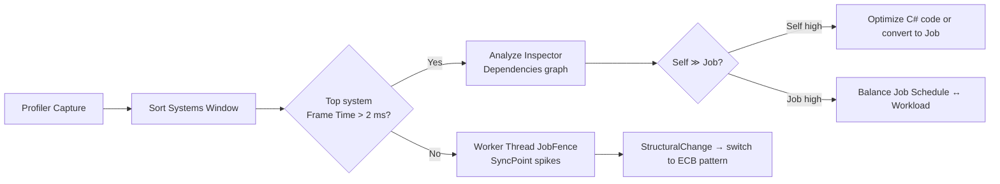

# Identifying Bottlenecks with the Profiler & Systems Window
### Leveraging the Inspector Dependencies tab and execution time columns

When an **FPS drop** or **frame spike** occurs in a Unity Entities project,
first open the **Profiler** and **Systems Window** together to find the bottleneck system.

---

## 1. Profiler Setup

| Step | Method |
|------|------|
| **Deep Profile Off** | Generally keep it off, and turn it ON only when specific function analysis is required |
| **Record** | Capture 300–500 frames in advance and review playback |
| **Modules** | Add **CPU Usage**, **Timeline**, and **Entity Debugger** modules |
| **Filters** | Display only specific Worlds and Worker threads to reduce noise |

### 1‑1 Timeline View

* **Main Thread** — Check the length of the `PlayerLoop` → `SimulationSystemGroup.OnUpdate` section
* **Worker Threads** — Identify `JobXxx` execution times and `JobFence` wait sections
* **SyncPoint** — `EntityCommandBufferPlayback` events → StructuralChange bottlenecks

---

## 2. Systems Window – Frame Time Column

| Column | Meaning |
|----|------|
| **Frame Time** | Total time taken for system execution plus internal job completion |
| **Self** | Pure C# code execution time on the main thread (excluding jobs) |
| **Avg** | Average over the last N frames |
| **Max** | Maximum value (for tracking spikes) |

> **Tip**: Click the column header to sort by **Frame Time DESC** → check the top 5 bottleneck systems.

---

## 3. Inspector Dependencies Tab

* **Select a system** → the **Dependencies** tab activates at the bottom of the Inspector
* **Edges (lines)**
  * Blue: `UpdateBefore/After` relationships
  * Green: automatic JobHandle dependencies
  * Red: circular dependency errors
* **Node (circle)** size: proportional to Frame Time → visualizes bottlenecks

### 3‑1 Usage Example

1. Select a system with a long Frame Time
2. In the Dependencies graph, look for lines that are **waiting (JobFence)**
3. Identify the system being waited on → check for Burst Off or excessive Complete() calls

---

## 4. Bottleneck Diagnosis Workflow

```mermaid
graph LR
A[Profiler Capture] --> B[Sort Systems Window]
B --> C{Top system <br>Frame Time > 2 ms?}
C -- Yes --> D[Analyze Inspector<br>Dependencies graph]
C -- No --> E[Worker Thread JobFence<br>SyncPoint spikes]
D --> F{Self ≫ Job?}
F -- Self high --> G[Optimize C# code or convert to Job]
F -- Job high --> H[Balance Job Schedule ↔ Workload]
E --> I[StructuralChange → switch to ECB pattern]
```

---

## 5. Resolution Guide by Checkpoint

| Symptom | Cause | Response |
|------|------|------|
| **High Self time** | Burst not used, LINQ/Alloc | `BurstCompile`, reuse `NativeList` |
| **High JobFence wait** | Missing job dependencies, excessive Complete | Connect dependencies, rewrite with `ScheduleParallel` |
| **SyncPoint spike** | Main thread StructuralChange | Defer changes with ECB, toggle Enableable |
| **Worker threads inactive** | Few query results, empty jobs | `[RequireMatchingQueries]`, replace with Run loop |
| **Red circular dependency line** | UpdateBefore/After conflict | Reorder or split groups |

---

## 6. Practical Checklist

- [ ] How many ms does the `SimulationSystemGroup` section take in the Profiler **Timeline**?
- [ ] Have you recorded the top 5 systems by **Frame Time** in the Systems Window?
- [ ] Are there no **red circular** warnings in the Dependencies graph?
- [ ] Is there a section where MainThread Wait Time > 2 ms due to Worker Thread **JobFence**?
- [ ] Are SyncPoint events less than once per frame?

> By using the Profiler, Systems Window, and Inspector Dependencies tab **together**,
> you can instantly identify "which system" is slow, "why", and "where" it's waiting — all without modifying scripts.
