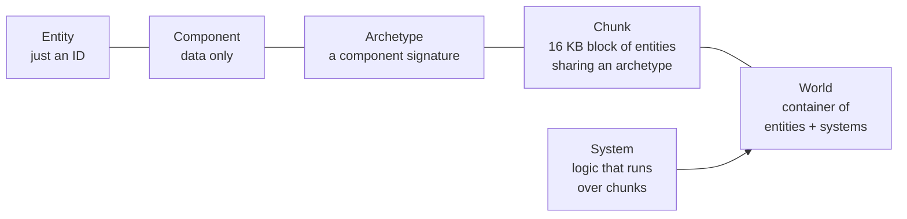

# ECS Core Concepts
### Unity 6000.5 · Entities 6.5.0

---

## 1. The five nouns

Entities ECS boils down to five nouns:



Internalising this diagram is most of what it takes to read existing DOTS code.

---

## 2. Entity

An **entity** is just a 64-bit handle: `struct Entity { int Index; int Version; }`. It has no data and no methods beyond identity — all data lives in components.

```csharp
Entity e = state.EntityManager.CreateEntity();   // fresh, no components
state.EntityManager.AddComponent<Health>(e);     // now it has data
state.EntityManager.DestroyEntity(e);            // handle becomes stale
```

The `Version` field invalidates old references: if you destroy and recreate at the same `Index`, the old `Entity` value no longer matches.

---

## 3. Component

A **component** is a plain data container. It carries no behaviour. Code lives in systems.

```csharp
public struct Health : IComponentData
{
    public float Value;
    public float Max;
}
```

There are several component variants (unmanaged, managed, buffer, shared, cleanup, tag, chunk, enableable). See [`05_Component Types.md`](05_Component Types.md).

---

## 4. Archetype

An **archetype** is a unique set of component types that some entities share.

- An entity with `{ LocalTransform, Health, Enemy }` belongs to archetype A.
- An entity with `{ LocalTransform, Health, Enemy, Burning }` belongs to archetype B — a different one, because adding `Burning` changed the component set.

Moving between archetypes (adding/removing a component) is a **structural change** and physically moves the entity to a new chunk. See [`13_Structural Change & Safety.md`](13_Structural Change & Safety.md).

---

## 5. Chunk

Entities in the same archetype are packed into **16 KB chunks**. Within a chunk, each component type forms a contiguous array — great for cache locality.

| Fact | Implication |
|------|------------|
| Chunks are 16 KB | Each component eats a slice; the more (or larger) components in the archetype, the fewer entities per chunk. |
| Data is laid out column-wise (SoA) per component | `IJobChunk` can iterate one component array at a time and vectorise with Burst. |
| Adding/removing a component moves the entity | Structural change. Query iterators assume the archetype is stable while iterating. |
| Chunks track component change versions | Systems can skip chunks that didn't change since last run (`EntityQuery.SetChangedVersionFilter`). |

You can inspect live chunk layout in **Window → Entities → Archetypes**.

---

## 6. System

A **system** is a piece of logic that runs each frame, typically over a query of entities.

```csharp
[BurstCompile]
public partial struct HealthRegenSystem : ISystem
{
    [BurstCompile]
    public void OnUpdate(ref SystemState state)
    {
        float dt = SystemAPI.Time.DeltaTime;

        foreach (var health in SystemAPI.Query<RefRW<Health>>())
        {
            health.ValueRW.Value = math.min(health.ValueRW.Value + dt, health.ValueRW.Max);
        }
    }
}
```

Systems are registered automatically and live inside a **SystemGroup**. See [`08_System — ISystem vs SystemBase.md`](08_System — ISystem vs SystemBase.md) and [`09_System Group & Update Order.md`](09_System Group & Update Order.md).

---

## 7. World

A **World** is a container that owns:

- An **EntityManager** (creates, destroys, queries entities).
- A set of **systems** and their SystemGroups.
- The chunks themselves (via the EntityManager).

The default runtime world is `DefaultGameObjectInjectionWorld`. Most games have one world in production; multi-world setups show up in Netcode (server / client) or in editor tooling. See [`16_Netcode Client-Server World & Bootstrap.md`](16_Netcode Client-Server World & Bootstrap.md) for the Netcode world split.

```csharp
World world = World.DefaultGameObjectInjectionWorld;
EntityManager em = world.EntityManager;

Entity e = em.CreateEntity(typeof(Health));
em.SetComponentData(e, new Health { Value = 100, Max = 100 });
```

---

## 8. EntityManager

The `EntityManager` is the main-thread API for structural changes: create, destroy, add/remove components, instantiate prefab-entities, copy worlds, etc. Structural changes through `EntityManager` are immediate and can invalidate any in-flight query iterators or job references.

For deferred structural changes from jobs or mid-iteration, use an **EntityCommandBuffer** — see [`14_EntityCommandBuffer · Deferred Entity.md`](14_EntityCommandBuffer · Deferred Entity.md).

---

## 9. Putting it together

```text
World
└── EntityManager
    └── Archetype { LocalTransform, Health, Enemy }
        └── Chunk  (up to ~N entities)
            └── Entity { Index, Version }
                ├── LocalTransform
                ├── Health
                └── Enemy (tag)
```

A system that queries `{ LocalTransform, Health }` touches every chunk whose archetype **contains both**. That includes the archetype above — plus any other archetype that also has `Enemy` plus extra components.

---

## 10. Troubleshooting

| Symptom | Cause / Fix |
|---------|-------------|
| `Entity` lookups return stale data | The entity was destroyed and recreated — the `Version` no longer matches. Re-resolve the entity. |
| Query matches nothing but the entity clearly has the component | Component was added in a different world, or the component is enableable and currently disabled. |
| `Archetype` count explodes | Too many unique component combinations (often from per-entity tags with high cardinality). Consolidate using shared components or enableable flags. |
| Chunk contains only 1-2 entities | Archetype is oversized — remove components the entity doesn't need, or split into multiple entities/archetypes. |
| `InvalidOperationException: … invalidated …` during iteration | A structural change happened mid-query. Use an ECB, or batch changes after the loop. |
