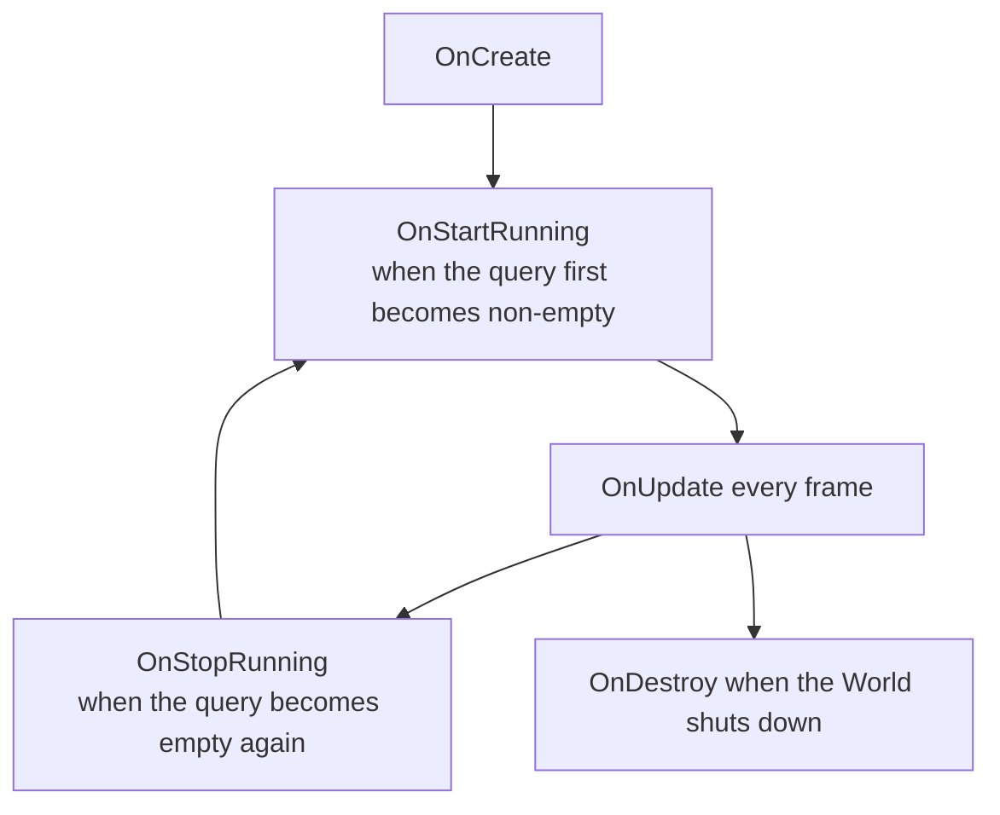

# System — ISystem vs SystemBase
### Unity 6000.5 · Entities 6.5.0

---

## 1. Overview

Entities has two ways to declare a system: **`ISystem`** (unmanaged `struct`) and **`SystemBase`** (managed `class`). Pick `ISystem` unless you specifically need what `SystemBase` gives you.

| | `ISystem` | `SystemBase` |
|-|-----------|--------------|
| Declared as | `partial struct : ISystem` | `partial class : SystemBase` |
| Memory | Unmanaged, stack-allocatable | Managed, GC-owned |
| Burst-compilable | **Yes** (add `[BurstCompile]`) | No |
| Managed fields | No | Yes |
| Managed API access | Through `EntityManager` + `ManagedAPI` | Directly |
| Default choice | ✅ | Only when you must |

---

## 2. `ISystem` — the default

```csharp
using Unity.Burst;
using Unity.Entities;

[BurstCompile]
public partial struct EnemyAISystem : ISystem
{
    [BurstCompile]
    public void OnCreate(ref SystemState state)
    {
        // Called once when the system is created.
        state.RequireForUpdate<EnemySpawnConfig>();
    }

    [BurstCompile]
    public void OnUpdate(ref SystemState state)
    {
        var config = SystemAPI.GetSingleton<EnemySpawnConfig>();
        // ... logic
    }

    [BurstCompile]
    public void OnDestroy(ref SystemState state)
    {
        // Called once when the system is destroyed.
    }
}
```

Mandatory bits:
- Struct must be `partial` — the source generator adds a hidden wrapper.
- All three methods (`OnCreate`, `OnUpdate`, `OnDestroy`) are optional — omit the ones you don't need.
- `[BurstCompile]` on the struct **and** on each method you want Burst-compiled.

---

## 3. `SystemBase` — when a managed system is unavoidable

```csharp
using Unity.Entities;

public partial class PlayerInputSystem : SystemBase
{
    private InputActions _input;   // managed field — the reason SystemBase exists

    protected override void OnCreate()
    {
        _input = new InputActions();
        _input.Enable();
    }

    protected override void OnUpdate()
    {
        var move = _input.Gameplay.Move.ReadValue<Vector2>();
        // ... dispatch to components
    }

    protected override void OnDestroy() => _input.Dispose();
}
```

Reach for `SystemBase` when:
- You hold a managed field that must live with the system (Input System objects, UI Toolkit handles, managed services, etc.).
- You need to call managed APIs directly inside `OnUpdate` without marshalling through the `EntityManager`.

Everything in `SystemBase` runs on the main thread without Burst.

---

## 4. System lifecycle

Both flavours share the same hook names:



| Hook | When it fires | Typical use |
|------|---------------|-------------|
| `OnCreate` | Once, at system creation | Cache queries, `RequireForUpdate<T>`, allocate native containers |
| `OnStartRunning` | Query(s) changed from empty → non-empty | Reset per-session state |
| `OnUpdate` | Every frame in the parent SystemGroup | Main work |
| `OnStopRunning` | Query(s) changed from non-empty → empty | Flush buffered state |
| `OnDestroy` | Once, at world teardown | Release native/managed resources |

### `RequireForUpdate<T>()`

Skip `OnUpdate` entirely when a required component or singleton is absent:

```csharp
public void OnCreate(ref SystemState state)
{
    state.RequireForUpdate<EnemySpawnConfig>();
    state.RequireForUpdate<GameRunning>();
}
```

This is the standard way to gate a system behind "config exists" / "game started."

---

## 5. Choosing between the two

Rules of thumb:

1. **Start with `ISystem`.** It's Burst-friendly and GC-free.
2. **Switch to `SystemBase` only when a managed field forces your hand.** Even then, consider splitting: keep the managed work in a thin `SystemBase` that pushes results into components, and run the heavy logic in an `ISystem` that reads those components.
3. **Do not mix** by adding a managed field to an `ISystem` struct — it won't compile. The split above is the idiomatic workaround.

Example split:

```csharp
// Managed — bridges Input System into components.
public partial class InputBridgeSystem : SystemBase
{
    private InputActions _input;
    // ... fills a PlayerInput singleton each frame
}

// Unmanaged + Burst — reads the PlayerInput singleton and drives gameplay.
[BurstCompile]
public partial struct PlayerMoveSystem : ISystem
{
    [BurstCompile]
    public void OnUpdate(ref SystemState state) { /* ... */ }
}
```

---

## 6. `SystemState` quick reference

Inside an `ISystem`, `ref SystemState state` is your window into the world.

| Member | Purpose |
|--------|---------|
| `state.EntityManager` | Main-thread structural changes. |
| `state.World` | The owning World. |
| `state.Dependency` | The current job dependency handle — combine with your scheduled jobs. |
| `state.GetEntityQuery(...)` | Build or retrieve a cached query. |
| `state.RequireForUpdate<T>()` | Gate the system on a component's presence. |
| `state.Enabled` | Set to `false` to skip the system without destroying it. |

In a `SystemBase`, these are members of the class itself (e.g. `this.EntityManager`).

---

## 7. Troubleshooting

| Symptom | Cause / Fix |
|---------|-------------|
| `error CS0246: The type or namespace name 'Entities' could not be found` | `using Unity.Entities;` missing. |
| `OnUpdate` never fires | `RequireForUpdate<T>` is gating on a component that doesn't exist yet — verify the component is created elsewhere. |
| Compile error: "partial struct must be declared partial" | `ISystem` requires `partial` so the source generator can extend the struct. |
| Burst warning: "method is not burst compiled" | Missing `[BurstCompile]` on the method. The attribute on the struct alone is not enough. |
| System runs on the wrong world (client vs server with Netcode) | Add `[WorldSystemFilter(...)]` to pick ServerSimulation / ClientSimulation / LocalSimulation. |
| Managed field can't be added to `ISystem` | Expected — split the managed part into a `SystemBase` as shown above. |
| System doesn't appear in `Window → Entities → Systems` | Missing `partial`, outside the default world, or excluded by `[DisableAutoCreation]`. |
