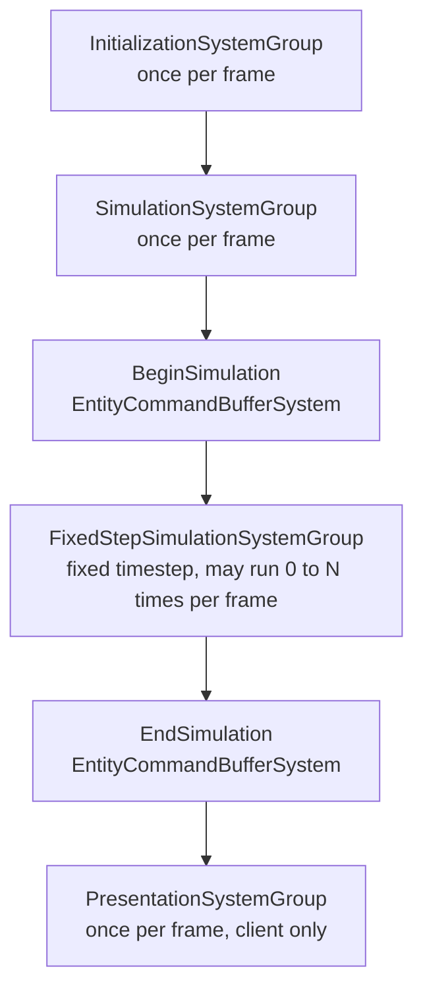

# System Group & Update Order
### Unity 6000.5 · Entities 6.5.0

---

## 1. Overview

Every system lives inside a **SystemGroup**. Groups decide when their children run each frame, and ordering attributes decide the sequence **within** a group. Getting the grouping right is how you avoid frame-late writes, race-conditions, and "why does this entity jitter" bugs.

---

## 2. Built-in groups



| Group | When it runs | Typical contents |
|-------|--------------|------------------|
| `InitializationSystemGroup` | Once per frame, before simulation | One-shot initializers, bootstrap tasks |
| `SimulationSystemGroup` | Once per frame | Most gameplay logic |
| `FixedStepSimulationSystemGroup` | **Fixed timestep** (default 60 Hz); may run 0, 1, or N times per frame | Physics, deterministic step logic |
| `PresentationSystemGroup` | Once per frame, after simulation | Render prep, interpolation |
| `BeginSimulationEntityCommandBufferSystem` | First thing in Simulation | Ordered ECB playback (early) |
| `EndSimulationEntityCommandBufferSystem` | Last thing in Simulation | Ordered ECB playback (late) |

Netcode for Entities adds more (PredictedSimulationSystemGroup, GhostSendSystem, etc.) — they nest inside the ones above.

---

## 3. Placing a system in a group

```csharp
using Unity.Entities;

[UpdateInGroup(typeof(SimulationSystemGroup))]
public partial struct EnemyAISystem : ISystem { /* ... */ }
```

If you omit `[UpdateInGroup]`, the system defaults to `SimulationSystemGroup`.

### Nesting

Groups can live inside other groups:

```csharp
[UpdateInGroup(typeof(SimulationSystemGroup), OrderFirst = true)]
public partial class GameplaySystemGroup : ComponentSystemGroup { }

[UpdateInGroup(typeof(GameplaySystemGroup))]
public partial struct MovementSystem : ISystem { /* ... */ }
```

`ComponentSystemGroup` is the base class for custom groups. They act as both systems and containers.

---

## 4. Ordering within a group

```csharp
[UpdateInGroup(typeof(SimulationSystemGroup))]
[UpdateAfter(typeof(EnemyAISystem))]
[UpdateBefore(typeof(MovementSystem))]
public partial struct EnemyPathfindingSystem : ISystem { /* ... */ }
```

| Attribute | Meaning |
|-----------|---------|
| `[UpdateBefore(typeof(X))]` | Run before `X` (both must be in the same group). |
| `[UpdateAfter(typeof(X))]` | Run after `X`. |
| `OrderFirst = true` (on `[UpdateInGroup]`) | Run as early as possible in the group. |
| `OrderLast = true` | Run as late as possible. |

> Tip: favour `[UpdateAfter]` chains over `OrderFirst/Last` — they read better in code review and survive refactors.

---

## 5. `[RequireMatchingQueriesForUpdate]`

A newer attribute (Entities 1.x+) that tells a system to **skip `OnUpdate` unless at least one entity matches each of its queries**:

```csharp
[RequireMatchingQueriesForUpdate]
public partial struct EnemyAISystem : ISystem
{
    public void OnUpdate(ref SystemState state)
    {
        // Only runs when there is at least one entity matching every query the system uses.
    }
}
```

Compare with `state.RequireForUpdate<T>()`, which requires a **specific** component/singleton. `[RequireMatchingQueriesForUpdate]` is more implicit — it keys off whatever queries the system ends up having.

---

## 6. Custom groups

Reasons to create one:

- Cohesive gameplay phase (e.g. "apply damage before animation").
- A different tick rate (e.g. a custom fixed step at 30 Hz).
- A feature toggle — enable/disable the whole group.

```csharp
using Unity.Entities;

[UpdateInGroup(typeof(SimulationSystemGroup))]
public partial class DamagePipelineGroup : ComponentSystemGroup
{
    // You can override OnUpdate to customise how the group ticks.
}

[UpdateInGroup(typeof(DamagePipelineGroup), OrderFirst = true)]
public partial struct ApplyDamageSystem : ISystem { /* ... */ }

[UpdateInGroup(typeof(DamagePipelineGroup))]
[UpdateAfter(typeof(ApplyDamageSystem))]
public partial struct DeathSystem : ISystem { /* ... */ }
```

### Custom tick rate

```csharp
public partial class SlowTickGroup : ComponentSystemGroup
{
    private float _accum;
    protected override void OnUpdate()
    {
        _accum += (float)SystemAPI.Time.DeltaTime;
        if (_accum < 0.1f) return;      // 10 Hz
        _accum = 0f;
        base.OnUpdate();                // tick children
    }
}
```

---

## 7. Fixed vs variable timestep

If determinism matters (physics, networked prediction, deterministic playback), put the system in `FixedStepSimulationSystemGroup`:

```csharp
[UpdateInGroup(typeof(FixedStepSimulationSystemGroup))]
public partial struct PhysicsStepSystem : ISystem { /* ... */ }
```

Gotchas:
- `FixedStepSimulationSystemGroup` may run **multiple times** per frame (or zero times) to catch up to real time.
- Use `SystemAPI.Time.DeltaTime` — it is the fixed step's dt inside this group.
- Anything that reads input or produces presentation should stay in `SimulationSystemGroup` / `PresentationSystemGroup`.

---

## 8. Inspecting the order at runtime

**Window → Entities → Systems** shows:

- Every group and its children, in actual run order.
- Per-system timing.
- Enabled / disabled state (systems you toggle at runtime).

If your attribute-declared order doesn't match what you see, there's almost always a circular dependency or a forgotten `[UpdateInGroup]`.

---

## 9. Troubleshooting

| Symptom | Cause / Fix |
|---------|-------------|
| System runs in the wrong frame phase | Missing or wrong `[UpdateInGroup]`. Default is `SimulationSystemGroup`. |
| `[UpdateAfter]` ignored | Target system is in a different group. Both must share a group. |
| Circular dependency error on startup | A chain of `[UpdateBefore]` / `[UpdateAfter]` forms a cycle. The Systems window prints the cycle. |
| System runs several times per frame unexpectedly | You placed it in `FixedStepSimulationSystemGroup` — that group catches up. Move to `SimulationSystemGroup` if it shouldn't. |
| Custom group runs forever | `OnUpdate` override never called `base.OnUpdate()`. |
| System runs but does nothing | `RequireForUpdate<T>` isn't satisfied, or every query is empty. Check **Window → Entities → Query**. |
