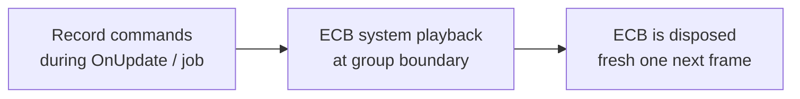

# EntityCommandBuffer · Deferred Entity
### Unity 6000.5 · Entities 6.5.0

---

## 1. Why ECB exists

`EntityCommandBuffer` (ECB) records structural changes — create, destroy, add, remove, set — and replays them later on the main thread at a safe point. It lets you mutate the world from:

- Inside a query `foreach` (where direct `EntityManager` calls would invalidate the iterator).
- A job (where main-thread structural changes aren't allowed).
- A parallel job across many chunks (via `ParallelWriter`).

See [`13_Structural Change & Safety.md`](13_Structural Change & Safety.md) for the "why this is dangerous" background.

---

## 2. The ECB lifecycle



An ECB is **single-use**: after playback it's disposed. You ask the right `EntityCommandBufferSystem` for a new one each frame.

---

## 3. Built-in ECB systems

| System | When it plays back | Typical use |
|--------|-------------------|-------------|
| `BeginInitializationEntityCommandBufferSystem` | Start of Initialization group | Early world setup from the previous frame |
| `EndInitializationEntityCommandBufferSystem` | End of Initialization group | — |
| `BeginSimulationEntityCommandBufferSystem` | Start of Simulation | Apply pending changes before gameplay runs |
| `EndSimulationEntityCommandBufferSystem` | End of Simulation | **Default pick** for spawns/destroys driven by gameplay |
| `BeginPresentationEntityCommandBufferSystem` | Start of Presentation | Rare; visual-only setup |

Picking the right one determines **when other systems observe your changes**. If you spawn a bullet in `SimulationSystemGroup` and want it to move **this same frame**, record into `BeginSimulation` next frame — or into `EndSimulation` if next frame is fine.

---

## 4. Getting an ECB

Inside any `ISystem.OnUpdate`:

```csharp
var ecb = SystemAPI
    .GetSingleton<EndSimulationEntityCommandBufferSystem.Singleton>()
    .CreateCommandBuffer(state.WorldUnmanaged);
```

The `.Singleton` nested type is a per-system token the source generator exposes for each built-in ECB system. `CreateCommandBuffer` gives you a fresh ECB that will be played back when that system ticks.

For parallel jobs:

```csharp
var ecb = SystemAPI
    .GetSingleton<EndSimulationEntityCommandBufferSystem.Singleton>()
    .CreateCommandBuffer(state.WorldUnmanaged)
    .AsParallelWriter();
```

See [`15_ParallelWriter · Deterministic Playback.md`](15_ParallelWriter · Deterministic Playback.md) for the parallel playback contract.

---

## 5. Recording — entity creation

```csharp
Entity e = ecb.CreateEntity();
ecb.AddComponent(e, new Health { Value = 100 });
ecb.AddComponent(e, LocalTransform.FromPosition(0, 0, 0));
```

Or instantiate from a prefab entity:

```csharp
Entity inst = ecb.Instantiate(prefab);
ecb.SetComponent(inst, LocalTransform.FromPosition(spawnPos));
```

Both `CreateEntity` and `Instantiate` return a **deferred entity** (see §6).

---

## 6. Deferred entities

An entity returned by `ecb.CreateEntity()` or `ecb.Instantiate()` **does not exist yet**. It has a placeholder negative index. You can:

- Pass it to subsequent ECB calls on the **same ECB** — `AddComponent`, `SetComponent`, `AppendToBuffer`.
- Store it in another component via `ecb.SetComponent(other, new ReferenceTo { Entity = inst })`.

You **cannot**:

- Read or write to it via `EntityManager` until the ECB plays back.
- Pass it between different ECBs (the placeholder only resolves inside the owning ECB).

At playback time the ECB system substitutes the real `Entity` handle everywhere the placeholder was used.

---

## 7. Recording — structural changes

```csharp
ecb.AddComponent(entity, new Stunned { Duration = 2f });
ecb.RemoveComponent<Stunned>(entity);
ecb.SetComponent(entity, new Health { Value = 50 });

ecb.SetComponentEnabled<Stunned>(entity, false);

var buf = ecb.AddBuffer<Waypoint>(entity);
buf.Add(new Waypoint { Position = new float3(1, 0, 0) });
ecb.AppendToBuffer(entity, new Waypoint { Position = new float3(2, 0, 0) });

ecb.DestroyEntity(entity);
```

All of these are queued commands; none take effect until playback.

---

## 8. ECB from an `IJobEntity`

```csharp
[BurstCompile]
public partial struct KillOnHealthZeroJob : IJobEntity
{
    public EntityCommandBuffer ECB;

    void Execute(Entity entity, in Health health)
    {
        if (health.Value <= 0)
            ECB.DestroyEntity(entity);
    }
}

// In OnUpdate:
var ecb = SystemAPI
    .GetSingleton<EndSimulationEntityCommandBufferSystem.Singleton>()
    .CreateCommandBuffer(state.WorldUnmanaged);

new KillOnHealthZeroJob { ECB = ecb }.Schedule();
```

For `.ScheduleParallel()`, swap to `.AsParallelWriter()` and thread a `sortKey` through — covered in the next page.

---

## 9. Standalone (manual) ECBs

Sometimes you need playback you control yourself — e.g. inside a single `OnUpdate`:

```csharp
var ecb = new EntityCommandBuffer(Allocator.Temp);
// ... record ...
ecb.Playback(state.EntityManager);
ecb.Dispose();
```

Use this for self-contained, one-off mutation patterns. For anything that crosses system boundaries or runs in a job, use the built-in ECBS above.

---

## 10. Determinism

ECB commands play back in **record order** on single-writer ECBs. On a `ParallelWriter`, playback order depends on the `sortKey` you provide — see [`15_ParallelWriter · Deterministic Playback.md`](15_ParallelWriter · Deterministic Playback.md).

For Netcode / replay systems, deterministic playback is non-negotiable. Always pass a stable sort key (chunk index, entity-in-query index) and avoid recording in main-thread code paths that run in nondeterministic order.

---

## 11. Troubleshooting

| Symptom | Cause / Fix |
|---------|-------------|
| `InvalidOperationException: ECB has already been played back` | Reused across frames. Get a fresh ECB per OnUpdate via `CreateCommandBuffer`. |
| Deferred entity handle is `Entity.Null` after playback | You referenced it across two different ECBs. Keep both the create and the subsequent set on the same ECB. |
| Spawned entity doesn't appear this frame | Recorded into `EndSimulation` ECBS — playback is at end of frame. Switch to `BeginSimulation` next frame to observe it before most systems. |
| `ecb.SetComponent` throws "component does not exist" | Target entity doesn't have the component yet (`AddComponent` first) or playback hasn't happened. |
| `Dispose()` called on an ECB managed by ECBS | Don't call `Dispose()` on ECBs from `CreateCommandBuffer` — the ECBS handles lifetime. Only dispose standalone (`new EntityCommandBuffer(Allocator.Temp)`) ones. |
| Parallel ECB playback reorders commands | `sortKey` isn't deterministic. Use `[ChunkIndexInQuery]` or a stable query-provided index. |
