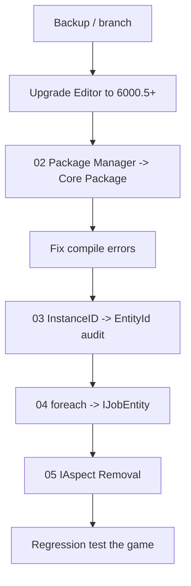

# Entities 1.x → 6.5 Overview
### Unity 6000.5 · Entities 6.5.0

---

## 1. What you're signing up for

Upgrading from Entities 1.x to 6.5 is really **three migrations** on two different version tracks:

1. **Editor upgrade.** You move to Unity 6000.4+ (`com.unity.entities` 6.4) or 6000.5+ (Entities 6.5). The engine itself brings its own changes along, notably the `InstanceID` → `EntityId` transition that started in Unity 6000.3 and tightens progressively through 6000.5 / 6000.6. Those are **engine-wide** changes — they affect every Unity project, not just ECS ones.
2. **Package distribution transition.** The `com.unity.entities` package 6.4 became a **Core Package** (embedded in the Editor). Your `manifest.json` loses its `com.unity.entities`, `com.unity.collections`, `com.unity.mathematics`, `com.unity.entities.graphics` entries.
3. **ECS API migration.** Legacy APIs marked obsolete in Entities 1.4 — `Entities.ForEach`, `IAspect` — are still obsolete (not removed) on 6.5 but slated for removal in the next major version. Also: `ComponentLookup.GetRefRWOptional` → `TryGetRefRW`.

Each migration is done in its own sub-document in this folder. This page is the **map** — when to do which, in what order.

> **Naming watch-out:** The Entities **package** version (1.4 / 6.4 / 6.5) is distinct from the Unity Editor version (6000.3 / 6000.4 / 6000.5). They align by convention from 6.4 onward but are tracked in separate release notes. This document treats them as two axes; the Changelog page ([`../Changelog/Entities 1.4 → 6.5 Key Changes.md`](../Changelog/Entities 1.4 → 6.5 Key Changes.md)) does the same.

---

## 2. Recommended order

Why this order:

- **Editor first** because nothing else compiles against 6.x APIs until the Editor knows about them.
- **Package Manager → Core Package next** — without this, you have duplicate / conflicting package resolution.
- **InstanceID audit before refactors** — `EntityId` is engine-wide and surfaces in shared code; fixing it early avoids re-fixing it in every ECS refactor.
- **foreach / IAspect last** — these are ECS-internal; they don't block the rest of the codebase.

---

## 3. What stays the same

A surprising amount — which makes the migration less scary than it looks.

| Unchanged | Notes |
|-----------|-------|
| `IComponentData`, `IBufferElementData`, `ISharedComponentData` | Same interfaces, same semantics. |
| `ISystem` / `SystemBase` | Same lifecycle hooks, same attributes. |
| `EntityManager` API surface | `CreateEntity`, `AddComponent`, etc. — identical. |
| `SystemAPI.Query` | Introduced in 1.x and stays the central iteration API. |
| `IJobEntity`, `IJobChunk` | Same shape; `IJobEntity` is the recommended default. |
| `EntityCommandBuffer` + ECBS | Same. |
| Burst, Jobs, Collections, Mathematics | Same. |
| Netcode for Entities concepts (Ghost, RPC, Prediction) | Same architecture; the package just distributes differently. |

If your 1.x code already uses `IJobEntity` and `SystemAPI.Query` (not legacy `Entities.ForEach`), steps 4 and 5 of the migration mostly disappear for you.

---

## 4. What changes, at a glance

| Area | 1.x | 6.5 |
|------|-----|-----|
| Distribution | `com.unity.entities` UPM package | Core Package (no manifest entry) |
| Version number | 1.4.x | 6.5.x (aligns with Unity 6000.5) |
| Identity for `UnityEngine.Object` | `InstanceID` (int) deprecated | `EntityId` (opaque) preferred |
| Component iteration (legacy) | `Entities.ForEach` marked obsolete in 1.4 | Still obsolete, still compiles with warnings; removal planned for Entities 2.0 |
| Aspects | `IAspect` marked obsolete in 1.4 | Still obsolete, still compiles; removal planned for Entities 2.0 |
| Optional refs | `GetRefRWOptional` / `GetRefROOptional` deprecated | `TryGetRefRW` / `TryGetRefRO` |

Full changelog for the period is in [`../Changelog/Entities 1.4 → 6.5 Key Changes.md`](../Changelog/Entities 1.4 → 6.5 Key Changes.md).

---

## 5. Backup strategy

Non-negotiable before starting:

1. **Branch in git.** Name it descriptively (`migrate/entities-6.5`). Do not migrate on `main`.
2. **Commit `manifest.json` and `packages-lock.json` in their pre-migration state.** They are the source of truth for reverting if resolution breaks.
3. **Tag the pre-migration commit.** `git tag pre-entities-6.5` makes reverts trivial.
4. **Keep the project open in the old Editor version until you're ready.** Opening in 6000.5 once changes the `ProjectVersion.txt` and forces the migration path.

---

## 6. Per-step checklists

### 6.1 Editor upgrade
- Install Unity 6000.5.x via Hub.
- Do **not** yet open the project. Commit any pending work first.
- Open the project in the new Editor — it will offer to upgrade `ProjectVersion.txt`. Accept.
- Let the initial import finish; expect warnings about deprecated APIs and missing packages. That's what the next steps fix.

### 6.2 Package cleanup → [`02_Package Manager → Core Package.md`](02_Package Manager → Core Package.md)
- Remove `com.unity.entities`, `com.unity.collections`, `com.unity.mathematics`, `com.unity.entities.graphics` from `manifest.json`.
- Delete `packages-lock.json` and let the Editor regenerate.
- Also remove Netcode for Entities if your project uses it (6.5 is a Core Package version).

### 6.3 Identity migration → [`03_InstanceID → EntityId.md`](03_InstanceID → EntityId.md)
- Grep audit per [`../Optimizations and Debugging/04_EntityId Audit — Deprecated InstanceID Hunt.md`](../Optimizations and Debugging/04_EntityId Audit — Deprecated InstanceID Hunt.md).
- Replace casts, string round-trips, sign/bit tricks.
- Re-key dictionaries that used `int` InstanceID.

### 6.4 Legacy ForEach → [`04_foreach → IJobEntity.md`](04_foreach → IJobEntity.md)
- For systems that still use `Entities.ForEach` / `Job.WithCode` — port to `IJobEntity` + `SystemAPI.Query`.

### 6.5 Aspect removal → [`05_IAspect Removal.md`](05_IAspect Removal.md)
- Inline aspect methods into the call site using `RefRW<T>` / `RefRO<T>` parameters.
- Delete the `IAspect` struct.

---

## 7. Testing after migration

Smoke tests to run before declaring the migration done:

1. **Play mode on a representative SubScene.** Entities exist, systems tick, nothing throws on start.
2. **Build a standalone player.** Build-only breakages (usually serialization) appear here.
3. **Run your existing gameplay regression tests.** If performance matters, capture a baseline Profiler trace from before migration and diff.
4. **Check save/load.** If save files contained InstanceIDs or entity indices, they are invalid — migrate on load or accept the data loss.
5. **Run on a target platform.** Some platform-specific backends (IL2CPP quirks, AOT) shake out here.

---

## 8. When to roll back

Clean rollback triggers:

- Editor won't open the project at all (rare; usually `ProjectVersion.txt` mismatch).
- `packages-lock.json` resolution produces a nonsense graph and deletion doesn't fix it.
- A critical package you depend on (third-party) isn't yet compatible with 6.5.

Plan: `git checkout pre-entities-6.5`, reinstall the older Unity version, verify the game still runs on the prior version.

Migrations that have partially completed but are stuck should be abandoned cleanly and restarted from the tag — do not ship half-migrated code.

---

## 9. Troubleshooting

| Symptom | Cause / Fix |
|---------|-------------|
| Editor won't open — "Project was saved in a newer version" | Someone opened it in 6000.5 previously; revert `ProjectSettings/ProjectVersion.txt` to the older string. |
| After manifest cleanup, compile error "Unity.Entities assembly not found" | The Editor is older than 6000.4 — Core Package isn't available. Upgrade the Editor or add the UPM package back. |
| Hundreds of deprecation warnings | Expected. Treat them as the migration punch list — each points at something to fix. |
| Build succeeds, game crashes on start | Usually an ECB or serialization issue introduced by removing a component. Diff the baked EntityScene asset size; huge reductions suggest a component was silently dropped. |
| Performance regresses after migration | Usually a `SystemBase` was introduced that shouldn't have been (managed field), or an `IJobEntity` fell back from Burst. Check the Profiler and Burst Inspector. |
