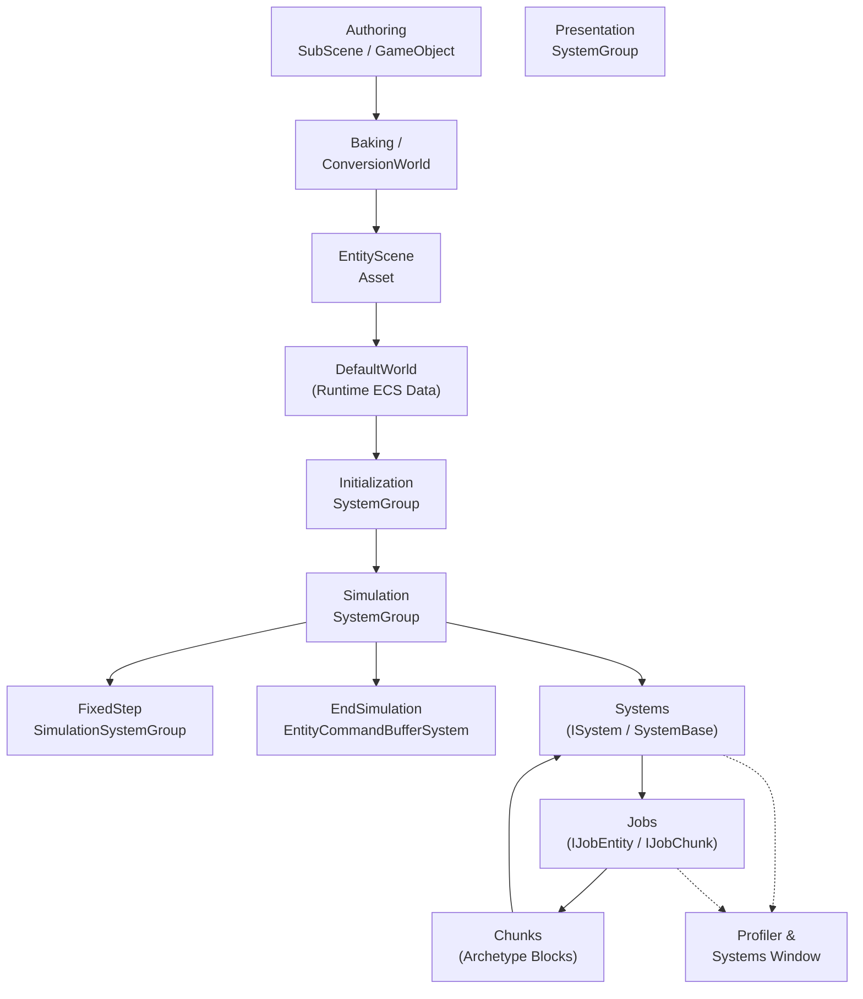

# Start‑with‑Unity DOTS 📚  

Unity **Entities 1.4** 매뉴얼 핵심내용을 요약하고, 예제·최적화 팁을 함께 모은 저장소입니다.  

## 📂 폴더 구조

```
Start-with-Unity_DOTS/
├─ DOTS Workflows/
│  ├─ 01_Baker 패턴 흐름.md
│  ├─ 02_Spawner 예제.md
│  ├─ 03_ECS 핵심 개념.md
│  ├─ 04_Structural Change & Safety.md
│  ├─ 05_Component 종류.md
│  ├─ 06_Enableable Component.md
│  ├─ 07_Singleton Component.md
│  ├─ 08_System.md
│  ├─ 09_System Group & Update Order 속성.md
│  ├─ 10_JobSystem.md
│  ├─ 11_IJobEntity · SystemAPI.Query · RequireMatchingQueries.md
│  ├─ 12_IJobEntity vs IJobChunk.md
│  ├─ 13_Structural Change.md
│  ├─ 14_Deferred Entity · Placeholder.md
│  └─ 15_ParallelWriter · Deterministic Playback.md
│
├─ DOTS Optimizations and Debugging/
│  ├─ 01_typemanager_chunk_optimization.md
│  ├─ 02_systems_entity_inspector_query_window.md
│  └─ 03_profiler_systems_window_bottleneck.md
│
├─ DOTS Version Upgrade guide/
│  ├─ 01_foreach_to_ijobentity.md
│  └─ 02_iaspect_removal.md
│
└─ Entities 1.4/
   ├─ Deprecated API & 대체 방법.md
   └─ 새 기능·개선점 & 주요 버그 픽스.md
```

---

## 🗺️ 추천 학습 코스

| 단계 | 읽을 파일 | 핵심 내용 |
|------|-----------|-----------|
| 1 | `DOTS Workflows/01_Baker 패턴 흐름.md` → `02_Spawner 예제.md` | SubScene·Baker·Spawner로 첫 ECS 체험 |
| 2 | `03_ECS 핵심 개념.md` → `05_Component 종류.md` | Entity·Component·Chunk 구조 완전 이해 |
| 3 | `08_System.md` → `09_System Group & Update Order 속성.md` | SystemBase vs ISystem, 그룹 정렬 |
| 4 | `10_JobSystem.md` → `11_...RequireMatchingQueries.md` → `12_IJobEntity vs IJobChunk.md` | Job 작성·병렬화·쿼리 최적 |
| 5 | `13~15_*.md` | ECB · Deferred Entity · Deterministic Playback |
| 6 | `DOTS Optimizations and Debugging/` | Chunk 활용률·Profiler·Inspector 사용 |

---

## Unity DOTS 구조 흐름도

---

## 📜 License

* Unity Entities Manual © Unity Technologies  
