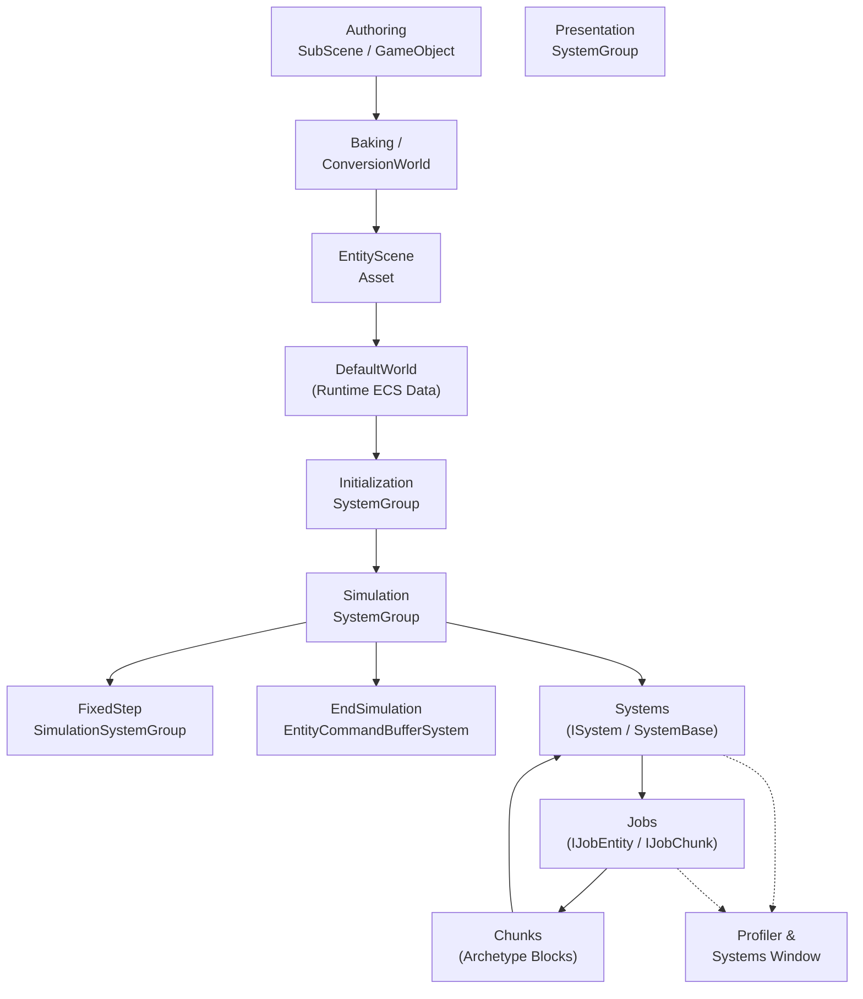

# Unity DOTS 구조 흐름도

```mermaid
flowchart TD
    A["Authoring<br/>SubScene / GameObject"]
    B["Baking /<br/>ConversionWorld"]
    C["EntityScene<br/>Asset"]
    D["DefaultWorld<br/>(Runtime ECS Data)"]
    E["Initialization<br/>SystemGroup"]
    F["Simulation<br/>SystemGroup"]
    G["Presentation<br/>SystemGroup"]
    F1["FixedStep<br/>SimulationSystemGroup"]
    F2["EndSimulation<br/>EntityCommandBufferSystem"]
    S["Systems<br/>(ISystem / SystemBase)"]
    J["Jobs<br/>(IJobEntity / IJobChunk)"]
    CH["Chunks<br/>(Archetype Blocks)"]
    P["Profiler &<br/>Systems Window"]

    A --> B
    B --> C
    C --> D
    D --> E
    E --> F
    F --> F1
    F --> F2
    F --> S
    S --> J
    J --> CH
    CH --> S
    S -.-> P
    J -.-> P

```
