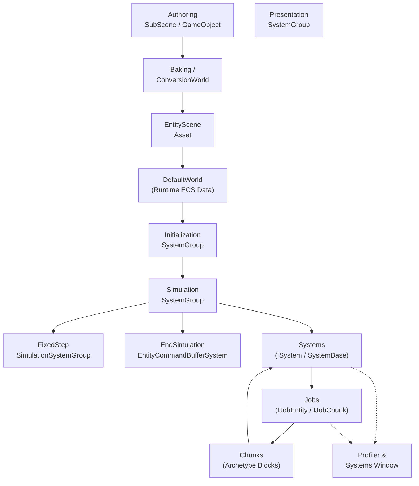

# Start‑with‑Unity DOTS 📚  

A repository that summarizes the core content of the **Unity Entities 1.4** manual, along with examples and optimization tips.

## 📂 Folder Structure

```
Start-with-Unity_DOTS/
├─ DOTS Workflows/
│  ├─ 01_Baker Pattern Flow.md
│  ├─ 02_Spawner Example.md
│  ├─ 03_ECS Core Concepts.md
│  ├─ 04_Structural Change & Safety.md
│  ├─ 05_Component Types.md
│  ├─ 06_Enableable Component.md
│  ├─ 07_Singleton Component.md
│  ├─ 08_System.md
│  ├─ 09_System Group & Update Order Attributes.md
│  ├─ 10_JobSystem.md
│  ├─ 11_IJobEntity · SystemAPI.Query · RequireMatchingQueries.md
│  ├─ 12_IJobEntity vs IJobChunk.md
│  ├─ 13_Structural Change.md
│  ├─ 14_Deferred Entity · Placeholder.md
│  └─ 15_ParallelWriter · Deterministic Playback.md
│
├─ DOTS Optimizations and Debugging/
│  ├─ 01_typemanager_chunk_optimization.md
│  ├─ 02_systems_entity_inspector_query_window.md
│  └─ 03_profiler_systems_window_bottleneck.md
│
├─ DOTS Version Upgrade guide/
│  ├─ 01_foreach_to_ijobentity.md
│  └─ 02_iaspect_removal.md
│
└─ Entities 1.4/
   ├─ Deprecated API & Replacements.md
   └─ New Features, Improvements & Major Bug Fixes.md
```

---

## 🗺️ Recommended Learning Path

| Step | Files to Read | Key Content |
|------|-----------|-----------|
| 1 | `DOTS Workflows/01_Baker Pattern Flow.md` → `02_Spawner Example.md` | First ECS experience with SubScene, Baker, and Spawner |
| 2 | `03_ECS Core Concepts.md` → `05_Component Types.md` | Complete understanding of Entity, Component, and Chunk structure |
| 3 | `08_System.md` → `09_System Group & Update Order Attributes.md` | SystemBase vs ISystem, group ordering |
| 4 | `10_JobSystem.md` → `11_...RequireMatchingQueries.md` → `12_IJobEntity vs IJobChunk.md` | Writing jobs, parallelization, and query optimization |
| 5 | `13~15_*.md` | ECB, Deferred Entity, Deterministic Playback |
| 6 | `DOTS Optimizations and Debugging/` | Chunk utilization, Profiler, and Inspector usage |

---

## Unity DOTS Architecture Flow

```mermaid
flowchart TD
    A["Authoring<br/>SubScene / GameObject"]
    B["Baking /<br/>ConversionWorld"]
    C["EntityScene<br/>Asset"]
    D["DefaultWorld<br/>(Runtime ECS Data)"]
    E["Initialization<br/>SystemGroup"]
    F["Simulation<br/>SystemGroup"]
    G["Presentation<br/>SystemGroup"]
    F1["FixedStep<br/>SimulationSystemGroup"]
    F2["EndSimulation<br/>EntityCommandBufferSystem"]
    S["Systems<br/>(ISystem / SystemBase)"]
    J["Jobs<br/>(IJobEntity / IJobChunk)"]
    CH["Chunks<br/>(Archetype Blocks)"]
    P["Profiler &<br/>Systems Window"]

    A --> B
    B --> C
    C --> D
    D --> E
    E --> F
    F --> F1
    F --> F2
    F --> S
    S --> J
    J --> CH
    CH --> S
    S -.-> P
    J -.-> P

```
---

## 📜 License

* Unity Entities Manual © Unity Technologies  
