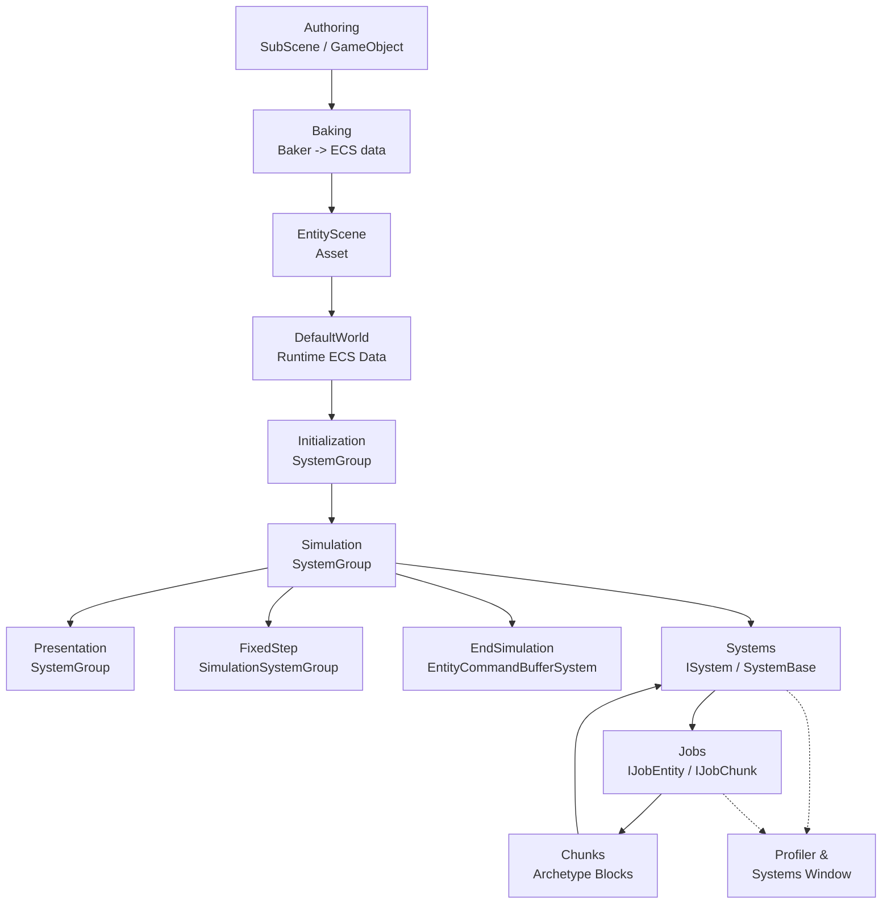
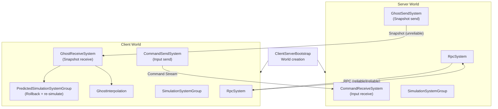

# Unity DOTS Manual 📚

A community manual for **Unity DOTS** (Data-Oriented Technology Stack) — concepts, workflows, Netcode for Entities, optimizations, and 1.x → 6.5 migration. Targets **Entities 6.5.0** and **Netcode for Entities 6.5.0** on **Unity 6000.5+**.

> **Project Environment:** Unity **6000.5.0b2** · Entities **6.5.0** · Netcode for Entities **6.5.0** · Collections / Entities Graphics / Unity Physics (Core Packages) · Mathematics 1.4.x

> Looking for the older Entities 1.4 version of this manual? See the [`legacy/entities-1.4`](https://github.com/luke-youngmin-cho/unity-dots-manual/tree/legacy/entities-1.4) branch.

> 🤖 Working with an AI coding agent in this repo? See [`AGENTS.md`](AGENTS.md) for version targets, style rules, and code conventions.

---

## 📂 Folder Structure

```
unity-dots-manual/
├─ Getting Started/
│  ├─ 01_Environment Setup (Unity 6000.5 + Entities 6.5.0).md
│  ├─ 02_Core Packages Explained.md
│  └─ 03_Hello DOTS — First Entity.md
│
├─ DOTS Workflows/
│  ├─ 01_Baker Pattern & SubScene.md
│  ├─ 02_Spawner Example.md
│  ├─ 03_ECS Core Concepts.md
│  ├─ 04_Entity References — Entity · EntityPrefabReference · UnityObjectRef.md
│  ├─ 05_Component Types.md
│  ├─ 06_Enableable Component.md
│  ├─ 07_Singleton Component.md
│  ├─ 08_System — ISystem vs SystemBase.md
│  ├─ 09_System Group & Update Order.md
│  ├─ 10_JobSystem & Burst.md
│  ├─ 11_IJobEntity · SystemAPI.Query.md
│  ├─ 12_IJobEntity vs IJobChunk.md
│  ├─ 13_Structural Change & Safety.md
│  ├─ 14_EntityCommandBuffer · Deferred Entity.md
│  ├─ 15_ParallelWriter · Deterministic Playback.md
│  ├─ 16_Netcode Client-Server World & Bootstrap.md
│  ├─ 17_Netcode Network Connection & Approval.md
│  ├─ 18_Netcode Ghost Snapshot & Synchronization.md
│  ├─ 19_Netcode Prediction & Rollback.md
│  ├─ 20_Netcode Command Stream & Input.md
│  ├─ 21_Netcode RPC.md
│  ├─ 22_Netcode Ghost Optimization · Importance · Relevancy.md
│  ├─ 23_Netcode Physics Integration & Lag Compensation.md
│  └─ 24_Netcode Profiler & Debugging.md
│
├─ Optimizations and Debugging/
│  ├─ 01_Chunk Layout & TypeManager.md
│  ├─ 02_Systems · Entity Inspector · Query Window.md
│  ├─ 03_Profiler · Bottleneck Analysis.md
│  └─ 04_Managed Object Reference Audit.md
│
├─ Migration/
│  ├─ 01_Entities 1.x → 6.5 Overview.md
│  ├─ 02_Package Manager → Core Package.md
│  ├─ 03_Managed Object References → UnityObjectRef.md
│  ├─ 04_foreach → IJobEntity.md
│  └─ 05_IAspect Removal.md
│
├─ Changelog/
│  ├─ Entities 1.4 → 6.5 Key Changes.md
│  └─ Netcode for Entities 1.4 → 6.5 Key Changes.md
│
├─ AGENTS.md          (agent-facing style guide — cross-agent standard)
├─ CLAUDE.md          (Claude Code shim; imports AGENTS.md)
├─ GLOSSARY.md        (one-line definitions of every key term)
├─ _TEMPLATE.md       (skeleton for new docs)
└─ README.md
```

---

## 🗺️ Recommended Learning Path

| Step | Files to Read | Key Content |
|------|---------------|-------------|
| 0 | [`01 Environment Setup`](Getting Started/01_Environment Setup (Unity 6000.5 + Entities 6.5.0).md) → [`02 Core Packages`](Getting Started/02_Core Packages Explained.md) → [`03 Hello DOTS`](Getting Started/03_Hello DOTS — First Entity.md) | Install Unity 6000.5, understand Core Packages, build your first entity |
| 1 | [`01_Baker Pattern & SubScene.md`](DOTS Workflows/01_Baker Pattern & SubScene.md) → [`02_Spawner Example.md`](DOTS Workflows/02_Spawner Example.md) | Authoring → Entity via SubScene + Baker |
| 2 | [`03_ECS Core Concepts.md`](DOTS Workflows/03_ECS Core Concepts.md) | Entity, Component, Archetype, Chunk, World |
| 3 | [`04_Entity References — Entity · EntityPrefabReference · UnityObjectRef.md`](DOTS Workflows/04_Entity References — Entity · EntityPrefabReference · UnityObjectRef.md) | Runtime entity handles, prefab references, and ECS-safe Unity object references |
| 4 | [`05_Component Types.md`](DOTS Workflows/05_Component Types.md) | `IComponentData` variants, buffers, shared, cleanup, tag, enableable |
| 5 | [`06_Enableable Component.md`](DOTS Workflows/06_Enableable Component.md) → [`07_Singleton Component.md`](DOTS Workflows/07_Singleton Component.md) | Component variants used every day |
| 6 | [`08_System — ISystem vs SystemBase.md`](DOTS Workflows/08_System — ISystem vs SystemBase.md) → [`09_System Group & Update Order.md`](DOTS Workflows/09_System Group & Update Order.md) | Systems, groups, ordering |
| 7 | [`10_JobSystem & Burst.md`](DOTS Workflows/10_JobSystem & Burst.md) → [`11_IJobEntity · SystemAPI.Query.md`](DOTS Workflows/11_IJobEntity · SystemAPI.Query.md) → [`12_IJobEntity vs IJobChunk.md`](DOTS Workflows/12_IJobEntity vs IJobChunk.md) | Parallelism, queries, chunk-level work |
| 8 | [`13_Structural Change & Safety.md`](DOTS Workflows/13_Structural Change & Safety.md) → [`14_EntityCommandBuffer · Deferred Entity.md`](DOTS Workflows/14_EntityCommandBuffer · Deferred Entity.md) → [`15_ParallelWriter · Deterministic Playback.md`](DOTS Workflows/15_ParallelWriter · Deterministic Playback.md) | Safe mutation, deferred ops, deterministic playback |
| 9 | [`Optimizations and Debugging/`](Optimizations and Debugging/) (all 4) | Chunk layout, Inspector tools, Profiler, managed reference audit |
| 10 | [`Migration/`](Migration/) (all 5) | Upgrading a 1.x project to 6.5 on Unity 6000.5+ |

### Networked DOTS extension

| Step | Files to Read | Key Content |
|------|---------------|-------------|
| 11 | [`16_Netcode Client-Server World & Bootstrap.md`](DOTS Workflows/16_Netcode Client-Server World & Bootstrap.md) → [`17_Netcode Network Connection & Approval.md`](DOTS Workflows/17_Netcode Network Connection & Approval.md) | Client/server worlds, bootstrap, connect/listen, approval, in-game state |
| 12 | [`18_Netcode Ghost Snapshot & Synchronization.md`](DOTS Workflows/18_Netcode Ghost Snapshot & Synchronization.md) | Ghost authoring, snapshot replication, GhostField, variants, prespawned Ghosts |
| 13 | [`19_Netcode Prediction & Rollback.md`](DOTS Workflows/19_Netcode Prediction & Rollback.md) → [`20_Netcode Command Stream & Input.md`](DOTS Workflows/20_Netcode Command Stream & Input.md) | Client prediction, rollback, command streams, `IInputComponentData`, `InputEvent` |
| 14 | [`21_Netcode RPC.md`](DOTS Workflows/21_Netcode RPC.md) | Reliable one-shot messages, approval RPCs, RPC receive lifecycle |
| 15 | [`22_Netcode Ghost Optimization · Importance · Relevancy.md`](DOTS Workflows/22_Netcode Ghost Optimization · Importance · Relevancy.md) | Snapshot budget, importance scaling, relevancy, prediction switching |
| 16 | [`23_Netcode Physics Integration & Lag Compensation.md`](DOTS Workflows/23_Netcode Physics Integration & Lag Compensation.md) | Predicted physics, lag compensation, multi physics worlds |
| 17 | [`24_Netcode Profiler & Debugging.md`](DOTS Workflows/24_Netcode Profiler & Debugging.md) → [`Netcode changelog`](Changelog/Netcode for Entities 1.4 → 6.5 Key Changes.md) | Netcode Profiler, PlayMode tools, debugging checklists, 1.4 → 6.5 changes |

---

## Unity DOTS Architecture Flow


```mermaid
flowchart TD
    A["Authoring<br>SubScene / GameObject"]
    B["Baking<br>Baker -> ECS data"]
    C["EntityScene<br>Asset"]
    D["DefaultWorld<br>Runtime ECS Data"]
    E["Initialization<br>SystemGroup"]
    F["Simulation<br>SystemGroup"]
    G["Presentation<br>SystemGroup"]
    F1["FixedStep<br>SimulationSystemGroup"]
    F2["EndSimulation<br>EntityCommandBufferSystem"]
    S["Systems<br>ISystem / SystemBase"]
    J["Jobs<br>IJobEntity / IJobChunk"]
    CH["Chunks<br>Archetype Blocks"]
    P["Profiler &<br>Systems Window"]

    A --> B
    B --> C
    C --> D
    D --> E
    E --> F
    F --> F1
    F --> F2
    F --> S
    S --> J
    J --> CH
    CH --> S
    S -.-> P
    J -.-> P
    F --> G
```

---

## Netcode for Entities Architecture Flow


```mermaid
flowchart TD
    subgraph Server["Server World"]
        S_SIM["SimulationSystemGroup"]
        S_GHOST["GhostSendSystem<br/>(Snapshot send)"]
        S_CMD["CommandReceiveSystem<br/>(Input receive)"]
        S_RPC["RpcSystem"]
    end

    subgraph Client["Client World"]
        C_SIM["SimulationSystemGroup"]
        C_RECV["GhostReceiveSystem<br/>(Snapshot receive)"]
        C_PRED["PredictedSimulationSystemGroup<br/>(Rollback + re-simulate)"]
        C_CMD["CommandSendSystem<br/>(Input send)"]
        C_INTERP["GhostInterpolation"]
        C_RPC["RpcSystem"]
    end

    BOOTSTRAP["ClientServerBootstrap<br/>World creation"]

    BOOTSTRAP --> Server
    BOOTSTRAP --> Client

    S_GHOST -- "Snapshot (unreliable)" --> C_RECV
    C_CMD -- "Command Stream" --> S_CMD
    C_RPC -- "RPC (reliable)" --> S_RPC
    S_RPC -- "RPC (reliable)" --> C_RPC

    C_RECV --> C_PRED
    C_RECV --> C_INTERP
```

---

## 📎 References

- [**Glossary**](GLOSSARY.md) — one-line definitions for every key term used in this manual
- [Entities 6.5 Manual (Unity)](https://docs.unity3d.com/Packages/com.unity.entities@6.5/manual/index.html)
- [Entities 6.5 Changelog](https://docs.unity3d.com/Packages/com.unity.entities@6.5/changelog/CHANGELOG.html)
- [Netcode for Entities 6.5 Manual (Unity)](https://docs.unity3d.com/Packages/com.unity.netcode@6.5/manual/index.html)
- [Netcode for Entities 6.5 Changelog](https://docs.unity3d.com/Packages/com.unity.netcode@6.5/changelog/CHANGELOG.html)

---

## 📜 License

- Unity Entities Manual © Unity Technologies
- Unity Netcode for Entities Manual © Unity Technologies
- This manual is a community summary for learning purposes.
