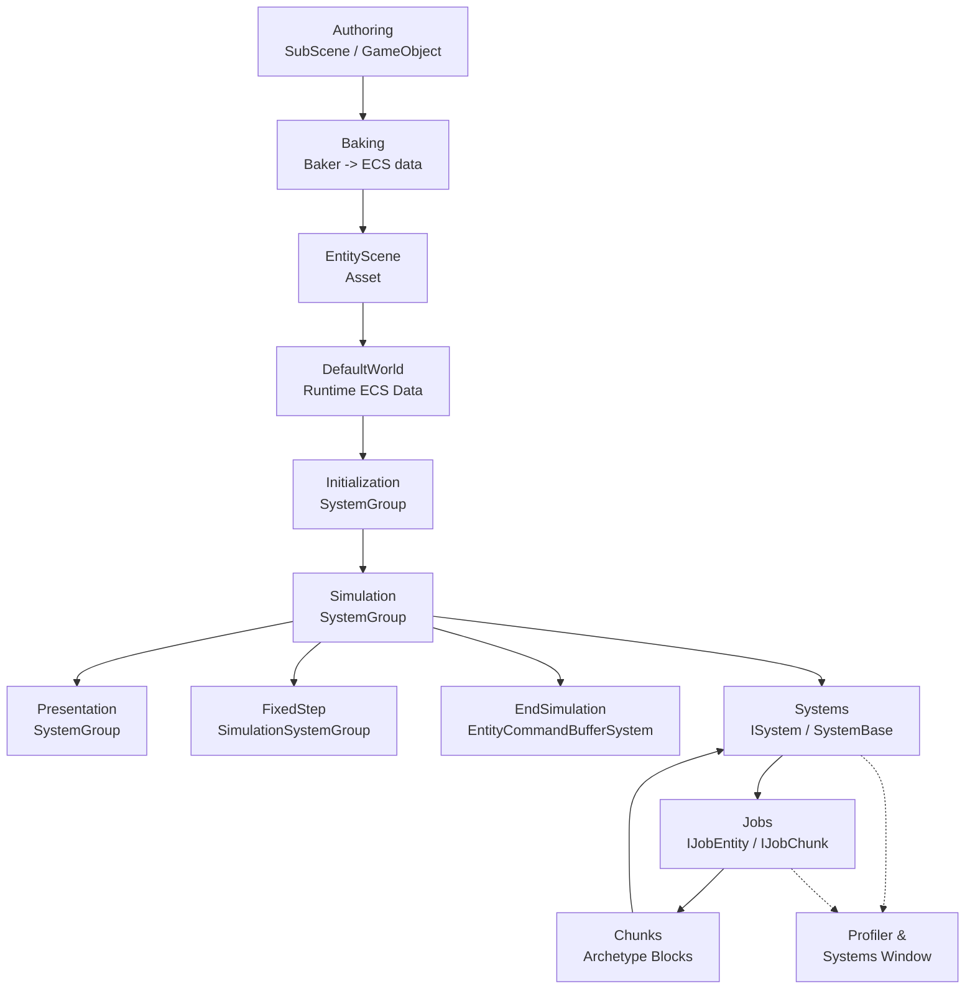

# Start-with-Unity DOTS 📚

A manual that summarizes the core concepts, workflows, and optimizations of **Unity DOTS** (Data-Oriented Technology Stack), targeting the latest **Entities 6.5.0** on **Unity 6000.5+**.

> **Project Environment:** Unity **6000.5.0b2** · Entities **6.5.0** · Collections / Mathematics / Entities Graphics (Core Packages)

> Looking for the older Entities 1.4 version of this manual? See the [`legacy/entities-1.4`](https://github.com/luke-youngmin-cho/unity-dots-manual/tree/legacy/entities-1.4) branch.

---

## 📂 Folder Structure

```
unity-dots-manual/
├─ Getting Started/
│  ├─ 01_Environment Setup (Unity 6000.5 + Entities 6.5.0).md
│  ├─ 02_Core Packages Explained.md
│  └─ 03_Hello DOTS — First Entity.md
│
├─ DOTS Workflows/
│  ├─ 01_Baker Pattern & SubScene.md
│  ├─ 02_Spawner Example.md
│  ├─ 03_ECS Core Concepts.md
│  ├─ 04_Identity Types — Entity · EntityId · UnityObjectRef.md
│  ├─ 05_Component Types.md
│  ├─ 06_Enableable Component.md
│  ├─ 07_Singleton Component.md
│  ├─ 08_System — ISystem vs SystemBase.md
│  ├─ 09_System Group & Update Order.md
│  ├─ 10_JobSystem & Burst.md
│  ├─ 11_IJobEntity · SystemAPI.Query.md
│  ├─ 12_IJobEntity vs IJobChunk.md
│  ├─ 13_Structural Change & Safety.md
│  ├─ 14_EntityCommandBuffer · Deferred Entity.md
│  └─ 15_ParallelWriter · Deterministic Playback.md
│
├─ Optimizations and Debugging/
│  ├─ 01_Chunk Layout & TypeManager.md
│  ├─ 02_Systems · Entity Inspector · Query Window.md
│  ├─ 03_Profiler · Bottleneck Analysis.md
│  └─ 04_EntityId Audit — Deprecated InstanceID Hunt.md
│
├─ Migration/
│  ├─ 01_Entities 1.x → 6.5 Overview.md
│  ├─ 02_Package Manager → Core Package.md
│  ├─ 03_InstanceID → EntityId.md
│  ├─ 04_foreach → IJobEntity.md
│  └─ 05_IAspect Removal.md
│
├─ Changelog/
│  └─ Entities 1.4 → 6.5 Key Changes.md
│
├─ AGENTS.md          (agent-facing style guide — cross-agent standard)
├─ CLAUDE.md          (Claude Code shim; imports AGENTS.md)
├─ GLOSSARY.md        (one-line definitions of every key term)
├─ _TEMPLATE.md       (skeleton for new docs)
└─ README.md
```

---

## 🗺️ Recommended Learning Path

| Step | Files to Read | Key Content |
|------|---------------|-------------|
| 0 | [`01 Environment Setup`](Getting Started/01_Environment Setup (Unity 6000.5 + Entities 6.5.0).md) → [`02 Core Packages`](Getting Started/02_Core Packages Explained.md) → [`03 Hello DOTS`](Getting Started/03_Hello DOTS — First Entity.md) | Install Unity 6000.5, understand Core Packages, build your first entity |
| 1 | [`01_Baker Pattern & SubScene.md`](DOTS Workflows/01_Baker Pattern & SubScene.md) → [`02_Spawner Example.md`](DOTS Workflows/02_Spawner Example.md) | Authoring → Entity via SubScene + Baker |
| 2 | [`03_ECS Core Concepts.md`](DOTS Workflows/03_ECS Core Concepts.md) | Entity, Component, Archetype, Chunk, World |
| 3 | [`04_Identity Types — Entity · EntityId · UnityObjectRef.md`](DOTS Workflows/04_Identity Types — Entity · EntityId · UnityObjectRef.md) | Disambiguate three similarly-named identity types: `Entity` (ECS handle, `Unity.Entities`), `EntityId` (engine-level `UnityEngine.Object` id, introduced in Unity 6000.3), `UnityObjectRef<T>` (ECS-side bridge to a `UnityEngine.Object`) |
| 4 | [`05_Component Types.md`](DOTS Workflows/05_Component Types.md) | `IComponentData` variants, buffers, shared, cleanup, tag, enableable |
| 5 | [`06_Enableable Component.md`](DOTS Workflows/06_Enableable Component.md) → [`07_Singleton Component.md`](DOTS Workflows/07_Singleton Component.md) | Component variants used every day |
| 6 | [`08_System — ISystem vs SystemBase.md`](DOTS Workflows/08_System — ISystem vs SystemBase.md) → [`09_System Group & Update Order.md`](DOTS Workflows/09_System Group & Update Order.md) | Systems, groups, ordering |
| 7 | [`10_JobSystem & Burst.md`](DOTS Workflows/10_JobSystem & Burst.md) → [`11_IJobEntity · SystemAPI.Query.md`](DOTS Workflows/11_IJobEntity · SystemAPI.Query.md) → [`12_IJobEntity vs IJobChunk.md`](DOTS Workflows/12_IJobEntity vs IJobChunk.md) | Parallelism, queries, chunk-level work |
| 8 | [`13_Structural Change & Safety.md`](DOTS Workflows/13_Structural Change & Safety.md) → [`14_EntityCommandBuffer · Deferred Entity.md`](DOTS Workflows/14_EntityCommandBuffer · Deferred Entity.md) → [`15_ParallelWriter · Deterministic Playback.md`](DOTS Workflows/15_ParallelWriter · Deterministic Playback.md) | Safe mutation, deferred ops, deterministic playback |
| 9 | [`Optimizations and Debugging/`](Optimizations and Debugging/) (all 4) | Chunk layout, Inspector tools, Profiler, EntityId audit |
| 10 | [`Migration/`](Migration/) (all 5) | Upgrading a 1.x project to 6.5 on Unity 6000.5+ |

---

## Unity DOTS Architecture Flow


```mermaid
flowchart TD
    A["Authoring<br>SubScene / GameObject"]
    B["Baking<br>Baker -> ECS data"]
    C["EntityScene<br>Asset"]
    D["DefaultWorld<br>Runtime ECS Data"]
    E["Initialization<br>SystemGroup"]
    F["Simulation<br>SystemGroup"]
    G["Presentation<br>SystemGroup"]
    F1["FixedStep<br>SimulationSystemGroup"]
    F2["EndSimulation<br>EntityCommandBufferSystem"]
    S["Systems<br>ISystem / SystemBase"]
    J["Jobs<br>IJobEntity / IJobChunk"]
    CH["Chunks<br>Archetype Blocks"]
    P["Profiler &<br>Systems Window"]

    A --> B
    B --> C
    C --> D
    D --> E
    E --> F
    F --> F1
    F --> F2
    F --> S
    S --> J
    J --> CH
    CH --> S
    S -.-> P
    J -.-> P
    F --> G
```

---

## 📎 References

- [**Glossary**](GLOSSARY.md) — one-line definitions for every key term used in this manual
- [Entities 6.5 Manual (Unity)](https://docs.unity3d.com/Packages/com.unity.entities@6.5/manual/index.html)
- [Entities 6.5 Changelog](https://docs.unity3d.com/Packages/com.unity.entities@6.5/changelog/CHANGELOG.html)
- [ECS Development Status (Unity Discussions, Dec 2025)](https://discussions.unity.com/t/ecs-development-status-december-2025/1699284)
- [CoreCLR Scripting & ECS Status Update (Unity Discussions, Mar 2026)](https://discussions.unity.com/t/coreclr-scripting-and-ecs-status-update-march-2026/1711852)

---

## 📜 License

- Unity Entities Manual © Unity Technologies
- This manual is a community summary for learning purposes.
