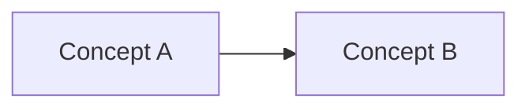

<!--
  Template for a new doc in this manual.
  Rules of the road are in AGENTS.md §4 (page structure) and §5 (code examples).

  Before committing:
  - Replace every <angle-bracket placeholder>.
  - Update the `updated:` date in the frontmatter.
  - Delete sections you don't use (but keep the numbering contiguous).
  - Delete this comment block.
-->

# <Doc Title>
### Unity 6000.5 · Entities 6.5.0

---

## 1. Overview

<Why does this doc exist? What will the reader know by the end? Keep to 2–4 sentences.>

---

## 2. <Core concept A>

<Definition or mental model. Keep paragraphs tight. Use diagrams where a picture beats prose.>



---

## 3. <Core concept B>

<…>

---

## 4. Code example

```csharp
using Unity.Entities;
using Unity.Burst;

// Burst-compatible; ISystem / IJobEntity preferred over SystemBase / Entities.ForEach.

public partial struct ExampleSystem : ISystem
{
    public void OnUpdate(ref SystemState state)
    {
        // ...
    }
}

[BurstCompile]
public partial struct ExampleJob : IJobEntity
{
    void Execute(ref ExampleComponent c)
    {
        // ...
    }
}
```

---

## 5. Troubleshooting

| Symptom | Cause / Fix |
|---------|-------------|
| <Observable error or wrong behaviour> | <Root cause + one-line fix> |
| <…> | <…> |

---

## 6. Related docs

- [`<relative/path/to/doc.md>`](<relative/path/to/doc.md>) — <one-line description>
